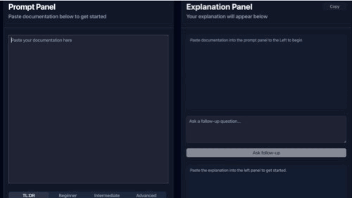

# Doc Explainer


## Preview



Understanding technical documentation can be slow and frustrating.

Doc Explainer is an AI-powered tool that converts complex documentation
into clear, structured explanations at multiple levels — from TL;DR to advanced.

Paste any documentation, choose your level, and get a real-time,
syntax-highlighted explanation with follow-up support.

## Why I Built This

I built Doc Explainer to explore how AI can improve developer workflows,
specifically around understanding complex documentation quickly.

This project demonstrates:

- LLM API integration
- streaming responses
- authentication and rate limiting
- markdown rendering with syntax highlighting

## Features

- **Paste documentation**: Drop in any docs or text and get an explanation.
- **Explanation levels**: TL;DR, Beginner, Intermediate, Advanced.
- **Streaming output**: Uses Vercel AI SDK (`streamUI`) to stream explanations as they’re generated.
- **Rich markdown rendering**: `react-markdown`, `remark-gfm`, and `react-syntax-highlighter` for code blocks and GitHub-style markdown.
- **Follow-up questions**: Ask follow-ups in the same conversation for deeper dives.
- **Copy to clipboard**: One-click copy of the generated explanation.
- **Fully responsive**: Layout and UI adapt to mobile, tablet, and desktop.
- **Theme toggle**: Light / Dark / System via `next-themes`.
- **Authentication (optional)**: Sign in with Google or GitHub via NextAuth (if provider env vars are configured).

## Tech Stack

- **Next.js 16** (App Router), **React 19**
- **Vercel AI SDK**: `@ai-sdk/rsc`, `@ai-sdk/openai` with OpenAI **GPT-4o**
- **Styling & UI**: Tailwind CSS 4, Radix UI, Lucide icons, Shoelace
- **Markdown & code**: `react-markdown`, `remark-gfm`, `react-syntax-highlighter`
- **Auth**: NextAuth (Google + GitHub providers)
- **Rate limiting**: Upstash Redis + `@upstash/ratelimit` (API route)

## Architecture

```text
Client (Next.js / React)
  ├─ InputPanel
  ├─ OutputPanel
        ↓
API Route (/api/explain)
        ↓
OpenAI Responses API
        ↓
Streaming Markdown Renderer
```

## Getting Started

### Prerequisites

- Node.js 18+
- An [OpenAI API key](https://platform.openai.com/api-keys)

### 1. Clone and install

```bash
git clone <your-repo-url>
cd doc-explainer
npm install
```

### 2. Environment variables

Create a `.env.local` file in the project root:

```env
# Required for AI explanations (server action + API route)
OPENAI_API_KEY=sk-...
```

Optional (for Upstash rate limiting on the REST API route):

```env
UPSTASH_REDIS_REST_URL=https://...
UPSTASH_REDIS_REST_TOKEN=...
```

Optional (for NextAuth Google/GitHub login):

```env
GOOGLE_CLIENT_ID=...
GOOGLE_CLIENT_SECRET=...
GITHUB_CLIENT_ID=...
GITHUB_CLIENT_SECRET=...
NEXTAUTH_SECRET=...
NEXTAUTH_URL=http://localhost:3000
```

### 3. Run the app

```bash
npm run dev
```

Then open [http://localhost:3000](http://localhost:3000) in your browser.

- Paste documentation into the **Prompt Panel**.
- Choose an explanation level.
- Click **Explain Documentation**.
- Use the **follow-up** box in the Explanation Panel to ask more questions.

## Scripts

| Command                | Description           |
| ---------------------- | --------------------- |
| `npm run dev`          | Start dev server      |
| `npm run build`        | Production build      |
| `npm run start`        | Run production server |
| `npm run lint`         | Run ESLint            |
| `npm run format`       | Format with Prettier  |
| `npm run format:check` | Check formatting      |

## Project Structure (high level)

- `app/page.tsx` – Main page: ties together input + output, calls `streamExplainAction`.
- `app/api/actions.tsx` – Server action powering streaming explanations and follow-ups.
- `app/api/route.ts` – REST API route using OpenAI and Upstash rate limiting.
- `app/types.ts` – Shared types (`Level`, `ExplainRequest`, `HistoryMessage`, etc.).
- `components/input-panel.tsx` – Prompt Panel UI (textarea, level tabs, submit).
- `components/output-panel.tsx` – Explanation Panel UI (streamed result, copy, follow-up).
- `components/markdown-output.tsx` – Renders markdown with syntax highlighting.
- `components/header.tsx` – App header (logo, auth buttons, theme toggle).
- `components/authbuttons.tsx` – Sign in / sign out UI using NextAuth.
- `components/mode-toggle.tsx` – Dark/light/system theme toggle.
- `lib/openai.ts` – OpenAI API client used by the REST API route.

## Learn More

- [Next.js Documentation](https://nextjs.org/docs)
- [Vercel AI SDK](https://sdk.vercel.ai/docs)
- [OpenAI API](https://platform.openai.com/docs)
